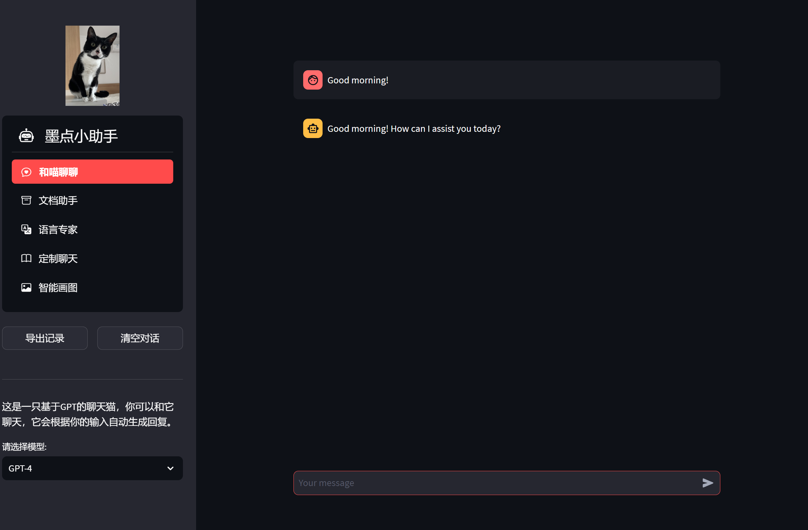

## Requirements:

`pip install -r requirements.txt`

## Add Password and OpenAI API settings

Add `.streamlit/secrets.toml` with the following settings:

```
password = "Password"
openai_api_type = "Openai API Type"
openai_api_base = "Openai API Base"
openai_api_key = "Openai API key"
openai_api_version = "Openai API key"
```

## Start the server:

`streamlit run webui.py`

